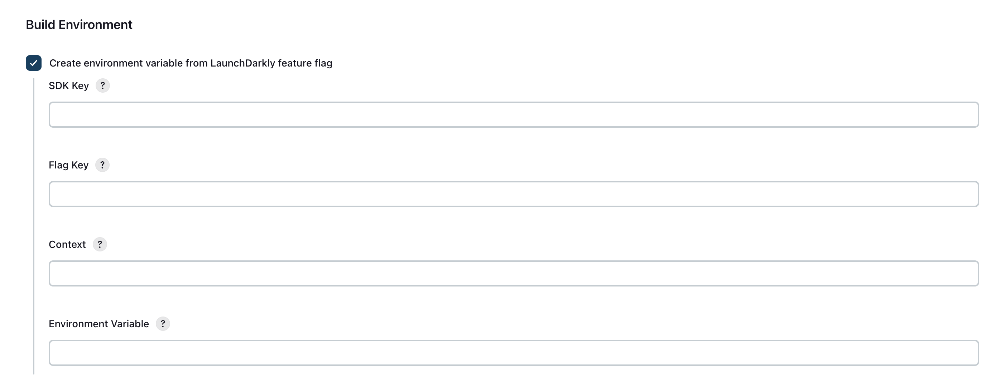
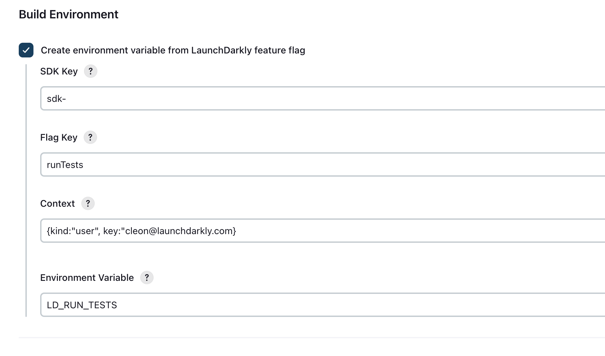
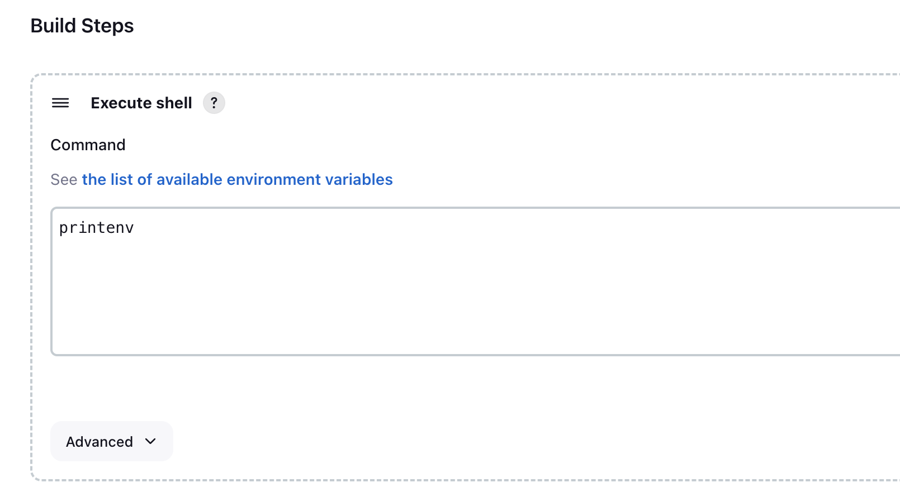
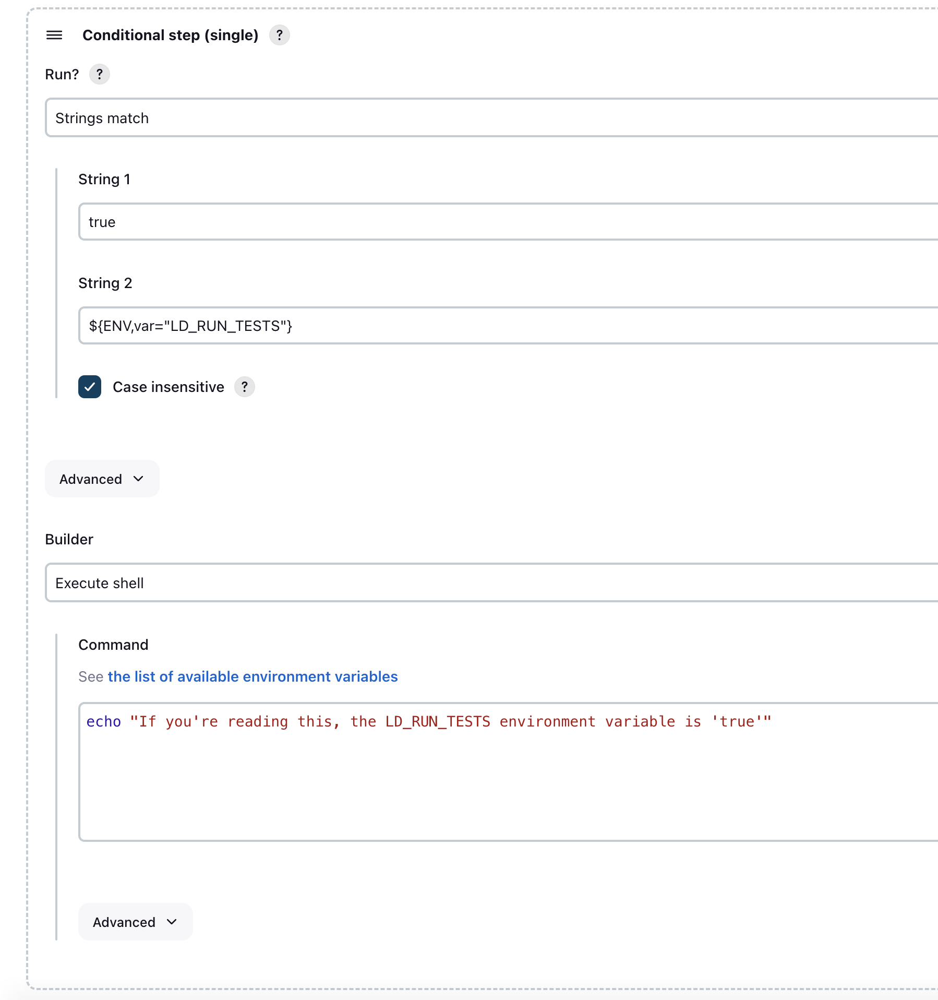
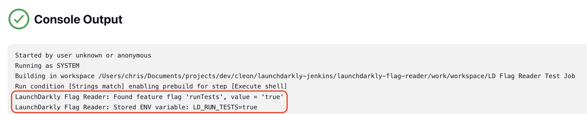
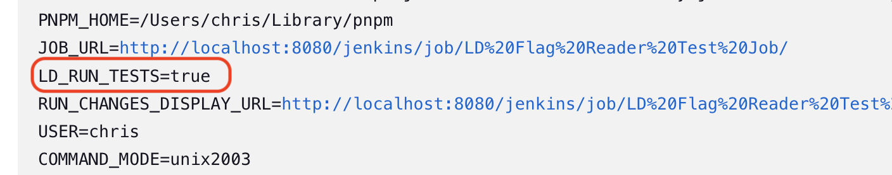
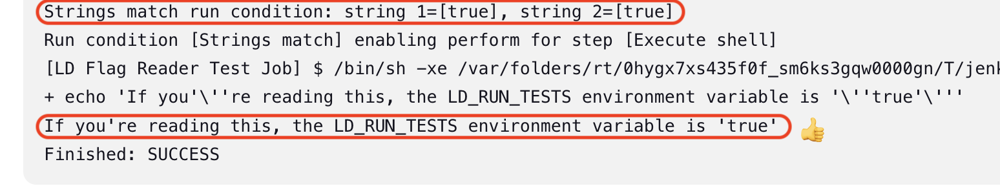
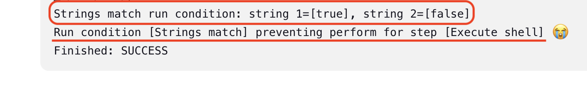

# LaunchDarkly Flag Reader Jenkins Plugin


## Overview

This simple plugin reads a LaunchDarkly feature flag value into an environment variable.

## Use cases

Use feature flag values to conditionally perform pre/post actions in your Jenkins jobs.

Here are some ideas:

- Read a boolean flag, use the value to conditionally execute subsequent tasks
  - **Example:** Create a boolean flag in LaunchDarkly called `runTests` and configure the plugin to save the value to
    a corresponding environment variable called `LD_RUN_TESTS`, then conditionally run integration tests based on the
    value of that
    environment variable.
- Store configuration value(s) in a flag (string, number, JSON) and retrieve the value at build-time
  - **Example:** Create a string flag in LaunchDarkly called `logLevel`, use the value to drive output logging levels
- Create [targeting rules](https://docs.launchdarkly.com/home/targeting-flags/targeting-rules) in LaunchDarkly, then
  provide input to them (via the `Context` string) to influence flag evaluations
  - **Example:** Manipulate build/test behaviors with flags, maybe things like `maxThreadCount` or `applyLinting`,
    based on
    build-time attributes you supply
    like `targetPlatform: "x64"`, `device: "mobile"`, `testType: "unit"`, `buildAgent: "slaveNode1"`, `appName: "myServerApp"`,
    etc.

## Installation

Download the latest plugin file here: **[launchdarkly-flag-reader.hpi](../../releases/latest)**

Install the plugin:

1. In Jenkins, go to the **"Manage Jenkins"** page
2. Click **"Manage Plugins"**
3. Click **"Advanced settings"**
4. Under **"Deploy Plugin"**, click **"Choose File"**
5. Select the downloaded **launchdarkly-flag-reader.hpi** file
6. Click the **"Deploy"** button

When installation completes, the plugin can be enabled in the **Build Environment** section of a build project.

## Configuration

After its installed and enabled, the plugin requires four pieces of information to operate:

- **SDK Key:**
  The <a href="https://docs.launchdarkly.com/home/getting-started/setting-up/?q=sdk+key#setting-up-an-sdk">SDK key</a>
  for the target LaunchDarkly Environment. This is found in LaunchDarkly on
  your <a href="https://docs.launchdarkly.com/home/organize/environments/?q=environment#opening-environments">
  Environment
  settings page</a>:
  - Account settings -> Projects -> (your Project) -> Environments -> (your Environment) -> SDK Key
- **Flag Key:** The flag key for your feature flag. This is in LaunchDarkly on
  your <a href="https://docs.launchdarkly.com/home/creating-flags/settings/?q=flag+se#overview">flag settings page</a>:
  - Feature Flags -> (your flag) -> Settings -> Key
- **Context:** The
  LaunchDarkly [Context](https://docs.launchdarkly.com/home/contexts/">https://docs.launchdarkly.com/home/contexts/) you
  want to apply to the feature flag evaluation. Examples:
  - Bare minimum: `{ kind: "user", key: "user-key-123" }`
  - Target on build flavor: `{ kind: "build", key: "jenkins-build", flavor: "debug" }`
  - Target multiple contexts:
  ```
  { context: {
     kind: "multi",
     build: {
       key: "build123",
       flavor: "RELEASE",
       target: "staging"
     },
     app: {
       key: "schedulingAPI",
       name: "Global Health Services",
       owner: "AppTeam1"
     }
    }
  }
  ```
- **Environment Variable:** The environment variable to store the value of the feature flag.

## Usage

The plugin works at the Job level in the **Build Environment** stage:


1. Check the box to enable the plugin.
2. Enter the required configuration values.
3. Save the Job settings.
4. If configured properly, the environment variable will be populated and available to subsequent steps.

## Example

Here's an example of a Job that demonstrates the plugin in action:

1. Configure the plugin:
   

2. To verify our environment variable was actually set, add a **"Execute shell"** build step to the job to print all
   environment
   variables to the console output (your syntax may vary):
   

3. Next, add a **"Conditional step (single)"** step. You can use this to test the value of the environment variable.
4. Set the **"Run"** option to **"Strings match."**
5. Set **"String 1"** to `true` (without quotes).
6. Set **"String 2"** to the name of the environment variable from. The syntax for this
   is `${ENV,var="your_environment_variable"}`
7. Set the **"Builder"** option to execute a batch command or shell (depending on your platform).
8. In **"Command"**, enter the command to print a message of some kind. This message will only be printed if the two
   strings match (your syntax max vary).
9. The configuration should look something like this:
   

10. Save your changes and click **"Build Now"** to start a new build.

When the build finishes, review its **"Console Output"**. You should see the environment variable set to the flag's
value:


You should also see the environment variable in the console output:


Finally, you'll only see the console message if the run condition you configured is `true`:


Here's the output of Job where the LaunchDarkly flag `runTests` was set to `false`:


Good job!
